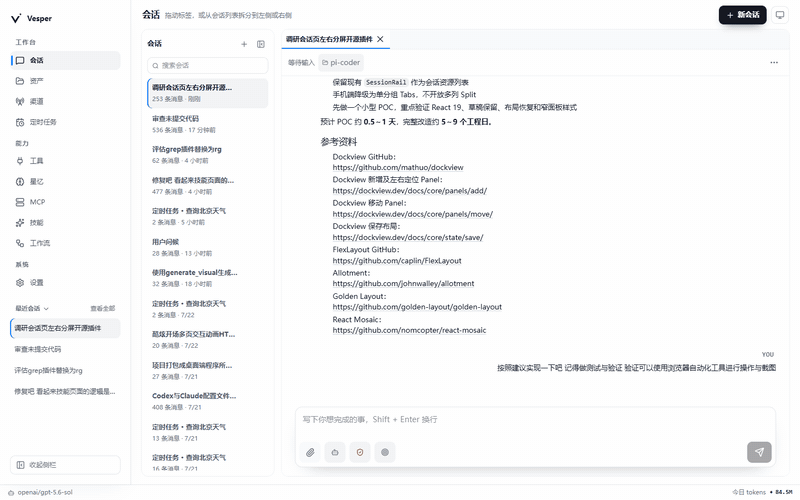
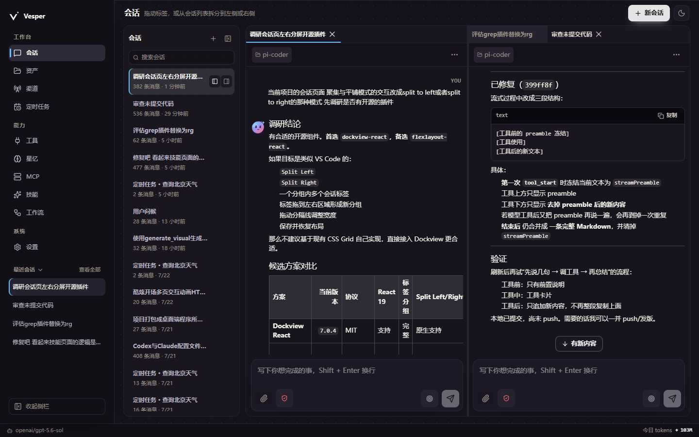
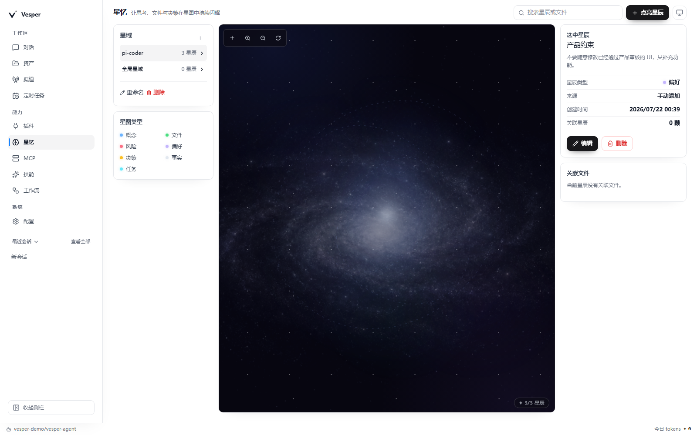
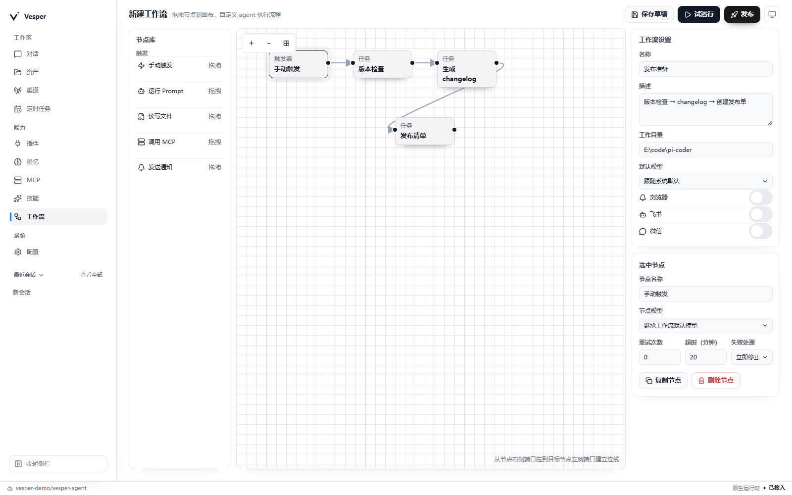
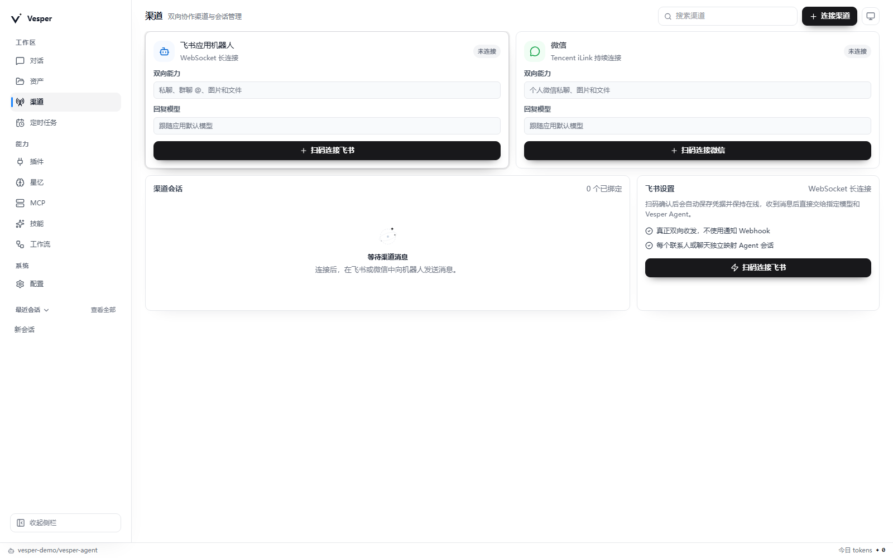

<p align="right"><strong>简体中文</strong> · <a href="./README.en.md">English</a></p>

<a id="top"></a>

<p align="center">
  
</p>

<h1 align="center">Vesper</h1>

<p align="center"><strong>暮色落下，灵感仍醒着。</strong></p>
<p align="center">本地优先的多 Agent 工作台，让会话、工具、记忆与工作流在同一片星图中并行运转。</p>

<p align="center">
  
  
  
  
  
</p>

<p align="center">
  <a href="https://github.com/ling-kong-ran/vesper/releases/latest">
    
  </a>
</p>
<p align="center"><sub>可直接下载安装包，无需克隆源码或配置 Node.js 开发环境。</sub></p>

<p align="center">
  <a href="#about">暮星之名</a> ·
  <a href="#glance">一眼 Vesper</a> ·
  <a href="#capabilities">能力星图</a> ·
  <a href="#architecture">代码星图</a> ·
  <a href="#start">从这里启程</a> ·
  <a href="#contributing">参与贡献</a>
</p>

---

<a id="about"></a>

## ✦ 暮星之名

**Vesper**，取意于黄昏与晚星。

白昼退场之后，仍有一束光守望尚未完成的工作。Vesper 希望成为这样的存在：安静、清醒、始终在场，把分散的模型、工具与上下文收拢成一张可见、可控、可继续生长的工作星图。

Vesper 是一款**本地优先的多 Agent 工作台**。你可以让多个独立会话同时推进，让每个 Agent 拥有自己的模型、权限、上下文与工作目录；通过可拖拽标签与 `Split Left` / `Split Right` 左右分屏，将任务编排成可随时调整并自动恢复的 IDE 式工作区。

> 让每个 Agent 各行其轨，让每一次思考都有归处。

- **并行而不混乱**：会话彼此独立，状态、权限与上下文清晰可见。
- **自动化而不越界**：定时任务与工作流负责重复劳动，敏感操作仍由你决定。
- **记住而不喧哗**：偏好、事实、决策与文件关系沉淀为本地「星忆」。
- **连接而不失守**：MCP、插件与外部渠道可以扩展能力，也始终受权限边界约束。

---

<a id="glance"></a>

## ✦ 一眼 Vesper



<table>
  <tr>
    <td width="50%" align="center">
      
      <br />
      <sub><strong>Dock 分屏工作区</strong> · 用标签、左右拆分与拖拽停靠并行推进任务</sub>
    </td>
    <td width="50%" align="center">
      
      <br />
      <sub><strong>星忆</strong> · 让值得保留的思考与决定持续发光</sub>
    </td>
  </tr>
  <tr>
    <td width="50%" align="center">
      
      <br />
      <sub><strong>工作流</strong> · 把一次设想编排成可运行、可复用的路径</sub>
    </td>
    <td width="50%" align="center">
      
      <br />
      <sub><strong>双向渠道</strong> · 让 Vesper 抵达飞书与个人微信</sub>
    </td>
  </tr>
</table>

---

<a id="capabilities"></a>

## ✦ 能力星图

| 模块 | 能力 |
| :--- | :--- |
| **多会话对话** | 多个独立 Agent 会话并行运行；模型、权限、上下文与工作目录彼此分明，支持标签分组、左右拆分、拖拽停靠、尺寸调整与布局恢复。 |
| **Agent Runtime** | 以 Pi Coding Agent 为运行内核，支持权限控制、结构化工具活动、Goal、可复用 Skills 与隔离的 Subagent 委派。 |
| **工具与 MCP** | 将内置工具、应用插件与 MCP 服务接入同一能力层，并通过不暴露凭据的结构化配置守住连接边界。 |
| **星忆** | 以轻量本地 SQLite 保存偏好、事实、决策与任务；按工作空间隔离，支持搜索、主动点亮、编辑与对话提取。 |
| **多模态** | 阅读图片、文档与代码，也可通过已配置的 OpenAI 兼容、Gemini、Imagen、Veo 或 xAI 模型生成及编辑视觉内容。 |
| **自动化** | 用定时任务与可视化工作流承接重复劳动，支持模型选择、重试、超时、失败策略、执行历史与完成通知。 |
| **双向渠道** | 连接飞书与个人微信，为每个渠道配置回复模型、工作目录、附件传输与可复用通知模板。 |
| **桌面应用** | 提供 Electron 原生窗口、单实例运行、品牌图标、应用内更新日志，以及基于 GitHub Releases 的更新能力。 |
| **安全边界** | 会话级权限模式、敏感操作审批、服务端凭据脱敏，以及独立于仓库之外的本地用户数据存储。 |

---

<a id="architecture"></a>

## ✦ 代码星图

```text
vesper/
├─ .github/              # CI、Release Notes 与全平台发布工作流
├─ docs/                 # 项目文档、截图与品牌资源
├─ electron/             # Electron 主进程与安全 preload
├─ public/               # 公共静态资源
├─ scripts/              # 图标生成、桌面打包与版本发布脚本
├─ shared/               # 前后端共享的工作流图逻辑
├─ server/
│  ├─ http/              # HTTP API、SSE 与静态资源响应
│  ├─ prompts/           # Agent 系统提示词与运行时身份注入
│  ├─ runtime/           # Pi Agent 会话与模型运行时
│  ├─ security/          # 凭据与输出脱敏
│  ├─ services/          # 渠道、星忆、工作流等领域服务与外部集成
│  ├─ storage/           # 本地持久化工具
│  ├─ tests/             # Node.js 测试
│  └─ tools/             # 内置工具与应用工具注册表
└─ src/
   ├─ app/               # 路由、导航、品牌与国际化
   ├─ assets/            # 前端静态资源
   ├─ components/        # 通用 React 组件
   ├─ features/          # 功能页面与交互
   ├─ hooks/             # 通用 React Hooks
   └─ lib/               # API 与格式化工具
```

---

<a id="start"></a>

## ✦ 从这里启程

### 直接下载桌面版

无需从源码构建。前往 [GitHub Releases 最新版本](https://github.com/ling-kong-ran/vesper/releases/latest)，即可直接下载 Windows、macOS 或 Linux 安装包。

> [下载最新版 Vesper 桌面安装包 →](https://github.com/ling-kong-ran/vesper/releases/latest)

### 从源码运行

以下环境要求仅适用于开发、Web 版运行或自行打包桌面应用。

#### 环境要求

- Node.js 20 或更高版本
- npm
- 至少一个受支持的模型 Provider 和 API Key

#### 安装依赖

```bash
git clone https://github.com/ling-kong-ran/vesper.git
cd vesper
npm install
```

### Web 版

启动开发服务：

```bash
npm run dev
```

服务就绪后，终端会明确打印访问地址。请在浏览器中打开 `http://127.0.0.1:5173`。Vesper 默认不会自动创建浏览器页签；如有需要，可设置环境变量 `VESPER_OPEN_BROWSER=1`。

Web 版启动时会比较当前 Git commit 与 GitHub `main` 分支，而不是等待 Release Tag。若远端已有尚未同步的提交，左侧导航栏底部会显示落后的提交数；点击即可查看差异。该检查只负责提醒，不会强制刷新页面、下载文件或覆盖本地源码。

更新源码前，请先提交或暂存本地修改，然后执行：

```bash
git pull
npm install
```

构建并运行 Web 生产版本：

```bash
npm run build
npm start
```

### 桌面版

启动或打包桌面应用：

```bash
npm run desktop:dev
npm run desktop:pack
```

桌面版会在启动后自动检查更新，并在左侧导航栏显示新版本提醒。更新不会自动下载；只有在用户确认后才会开始下载，并可先查看应用内更新日志。

发布新版本时，脚本会更新并提交 `package.json` 与 `package-lock.json`，创建 Git Tag，再由 GitHub Actions 生成更新日志并发布 Windows、macOS 与 Linux 安装包：

```bash
npm run release -- patch
# 也可使用 minor、major 或明确版本号，例如 1.2.0
```

### 本地数据

Vesper 默认将配置、会话、星忆与运行数据保存在：

```text
~/.vesper/agent
```

可通过环境变量 `VESPER_AGENT_DIR` 指定其他目录。

### 验证

```bash
npm run lint
npm test
npm run build
```

项目使用 Node.js 内置测试运行器，测试文件位于 `server/tests/`。

---

<a id="contributing"></a>

## ✦ 与 Vesper 同行

欢迎提交 Issue 与 Pull Request：

- [报告问题](https://github.com/ling-kong-ran/vesper/issues)
- [提交 Pull Request](https://github.com/ling-kong-ran/vesper/pulls)
- [查看贡献者](https://github.com/ling-kong-ran/vesper/graphs/contributors)

提交修改前，请运行上方的 lint、测试与构建命令。请勿提交 API Key、机器人凭据、本地会话数据，或 `~/.vesper/agent` 中的任何文件。

---

<a id="acknowledgements"></a>

## ✦ 致谢 · 星光所自

Vesper 以 [Pi Coding Agent](https://github.com/earendil-works/pi/tree/main/packages/coding-agent) 为运行内核，也由 Node.js、React、Electron、Vite、i18next 等开源项目共同照亮。

<p align="right"><a href="#top">返回顶部 ↑</a></p>
